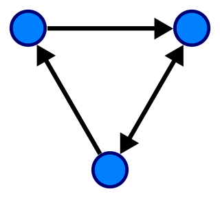

## 그래프 (Graph)

---

- 노드(vertex)와 노드를 연결하는 간선(edge)들로 구성된 비선형적 자료 구조
- Directed Graph
  - 간선이 한 방향으로만 연결됨(인스타그램 팔로우)
- Undirected Graph
  - 간선이 양 방향으로만 연결됨(페이스북 친구)
- 그래프 이론에서의 트리(Tree)
  - 비순환적이며(not simple cycle), 연결된(connected), 비방향성(undirected) 그래프

A directed graph with three vertices and three edges

### 그래프 구현

---

- 인접 행렬(Adjacency Matrix)
  - 행은 source vertex, 열은 destination vertex를 나타내는 2차원 행렬
  - 일반적으로 2차원 배열로 구현
  - 밀도가 낮은(sparse) 그래프 구현에 유리
- 인접 리스트(Adjacency List)
  - 각 정점마다 연결된 정점들의 리스트를 가짐
  - 일반적으로 해시 테이블로 구현
  - 밀도가 높은(dense) 그래프 구현에 유리

|                           | Adjacency List         | Adjacency Matrix |
| ------------------------- | ---------------------- | ---------------- |
| Store Graph               | O( \| V \| + \| E \| ) | O( \| V \| ^2)   |
| Vertices x and y adjacent | O( \| V \| )           | O(1)             |
| Add vertex                | O(1)                   | O( \| V \| ^2)   |
