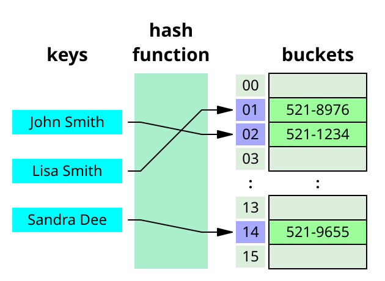

## 해시 테이블 (Hash Table)

---

- 연관 배열(associative array)를 구현하는 데이터 구조로, 키를 값에 매핑할 수 있음
- 해시 함수(hash function)을 사용해 키를 배열의 인덱스로 변환



### 해시 함수 (Hash Function)

---

- 키를 배열의 인덱스로 변환하는 역할
- 임의의 크기의 데이터를 고정된 크기의 값으로 변환

### 해시 함수의 특성

---

1. 결정성 - 같은 입력에 대해 항상 같은 출력이 나와야함
2. 균일성 - 출력이 가능한 범위에 대해 고르게 분포되어야함
3. 효율성 - 계산 속도가 빨라야함(상수 시간)

### 해시 함수 구현

---

- 입력은 문자열만 들어온다고 가정
- 해시 함수에 **소수를 사용하면 키 값들이 해시 테이블에 더 균일하게 분포됨**

```tsx
const hash = (key: string, arrayLength: number) => {
  let total = 0;
  const PRIME_NUMBER = 31;

  for (let i = 0; i < Math.min(key.length, 100); i++) {
    const value = key.charCodeAt(i) - 96;
    total = (total * PRIME_NUMBER + value) % arrayLength;
  }

  return total;
};
```

### 충돌(collision) 해결 방법

---

1. Chaining
   - 각 버킷에 연결 리스트를 사용하여 충돌이 발생하는 항목들을 저장
2. Linear Probing
   - 충돌 발생 시 비어있는 다른 버킷을 찾아 저장

## 시간 복잡도

---

- Insertion - O(1)
- Deletion - O(1)
- Access - O(1)
