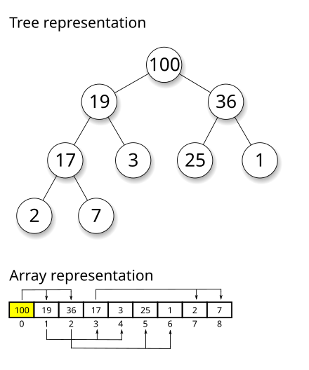

## 이진 힙(Binary Heap)

---

- 힙 속성(heap property)를 만족하는 트리 기반의 자료 구조
- Max Heap
  - 부모 노드는 항상 자식 노드보다 큰 값을 가짐
- Min Heap
  - 부모 노드는 항상 자식 노드보다 작은 값을 가짐



### 이진 힙 구현

---

- 보통 배열을 이용해서 구현
- 인덱스 $i$ 노드의
  - 왼쪽 자식 노드 - $2i + 1$
  - 오른쪽 자식 노드 - $2i + 2$
  - 부모 노드 - $\lfloor \dfrac{i-1}{2} \rfloor$
- `insert()`
  - 새로운 노드를 배열 끝에 추가
  - 추가된 자식 노드가 부모 노드보다 값이 크다면 부모 노드와 자리를 바꿈(`bubbleUp()`)
- `extractMax()`
  - 루트 노드에 있는 값을 반환하고 배열 끝에 있는 노드를 루트 노드로 설정
  - 새로운 루트 노드가 자식 노드보다 값이 작다면 자식 노드와 자리를 바꿈(`sinkDown()`)

```tsx
class MaxBinaryHeap {
  values: number[];

  constructor() {
    this.values = [];
  }

  insert(value: number) {
    this.values.push(value);
    this.#bubbleUp();
  }

  extractMax() {
    [this.values[0], this.values[this.values.length - 1]] = [
      this.values[this.values.length - 1],
      this.values[0],
    ];
    const max = this.values.pop();

    this.#sinkDown();

    return max;
  }

  #bubbleUp() {
    let targetIndex = this.values.length - 1;

    while (targetIndex > 0) {
      const parentIndex = Math.floor((targetIndex - 1) / 2);

      if (this.values[targetIndex] > this.values[parentIndex]) {
        [this.values[targetIndex], this.values[parentIndex]] = [
          this.values[parentIndex],
          this.values[targetIndex],
        ];

        targetIndex = parentIndex;
      } else {
        break;
      }
    }
  }

  #sinkDown() {
    let parentIndex = 0;

    while (true) {
      const leftChildIndex = 2 * parentIndex + 1;
      const rightChildIndex = 2 * parentIndex + 2;
      let leftChild;
      let rightChild;
      let largerChildIndex;

      if (leftChildIndex < this.values.length) {
        leftChild = this.values[leftChildIndex];
        if (leftChild > this.values[parentIndex]) {
          largerChildIndex = leftChildIndex;
        }
      }

      if (rightChildIndex < this.values.length) {
        rightChild = this.values[rightChildIndex];
        if (
          (!leftChild && rightChild > this.values[parentIndex]) ||
          (leftChild && rightChild > leftChild)
        ) {
          largerChildIndex = rightChildIndex;
        }
      }

      if (!largerChildIndex) {
        break;
      }

      [this.values[parentIndex], this.values[largerChildIndex]] = [
        this.values[largerChildIndex],
        this.values[parentIndex],
      ];

      parentIndex = largerChildIndex;
    }
  }
}

export default MaxBinaryHeap;
```
