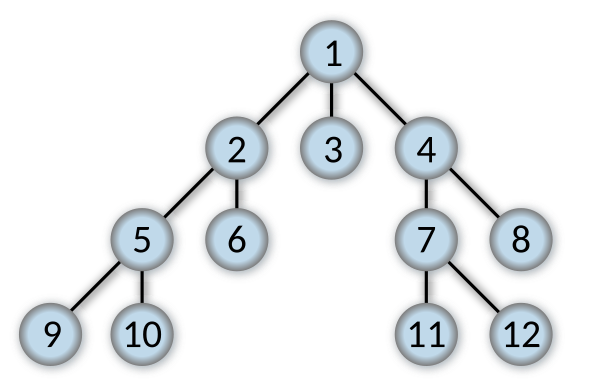

## 너비 우선 탐색(Breadth First Search)

---

- 루트 노드에서 시작하여 다음 depth로 이동하기 전에 현재 depth에 있는 모든 노드를 탐색
- 방문한 노드들을 큐에 저장하고, 큐에서 노드를 꺼내면서 그 노드와 인접한 노드들을 다시 큐에 저장하여 탐색



### 너비 우선 탐색 구현

```tsx
import BinarySearchTree from '../BinarySearchTree/BinarySearchTree';
import Node from '../BinarySearchTree/Node';

const BreadthFirstSearch = (tree: BinarySearchTree) => {
  const queue: Node[] = [];
  const visited: Node[] = [];

  if (tree.root) {
    queue.push(tree.root);
  }

  while (queue.length > 0) {
    const shiftedNode = queue.shift()!;
    visited.push(shiftedNode);

    if (shiftedNode?.left) {
      queue.push(shiftedNode.left);
    }

    if (shiftedNode?.right) {
      queue.push(shiftedNode.right);
    }
  }

  return visited;
};
```

## 공간 복잡도

---

- BFS는 큐를 사용하여 다음에 방문할 노드들을 저장하므로 그래프가 넓을수록 더 많은 메모리를 사용한다.
