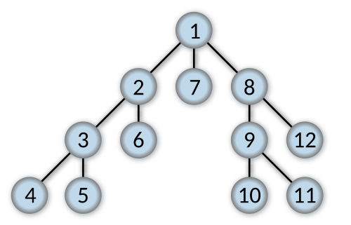

## 깊이 우선 탐색(Depth First Search)

---

- 루트 노드에서 시작하여 각 브랜치를 따라 가능한 깊이 탐색한 후 백트래킹
- 주로 스택이나 재귀(콜 스택)를 사용하여 구현



### 깊이 우선 탐색(pre-order) 구현

```tsx
import BinarySearchTree from '../BinarySearchTree/BinarySearchTree';
import Node from '../BinarySearchTree/Node';

const DepthFirstSearch = (tree: BinarySearchTree) => {
  const visited: Node[] = [];

  const traverse = (node: Node) => {
    visited.push(node);

    if (node.left) {
      traverse(node.left);
    }

    if (node.right) {
      traverse(node.right);
    }
  };

  if (tree.root) {
    traverse(tree.root);
  }

  return visited;
};
```

## 공간 복잡도

---

- DFS는 재귀적으로 구현되므로 그래프가 깊을수록 더 많은 메모리를 사용한다.
