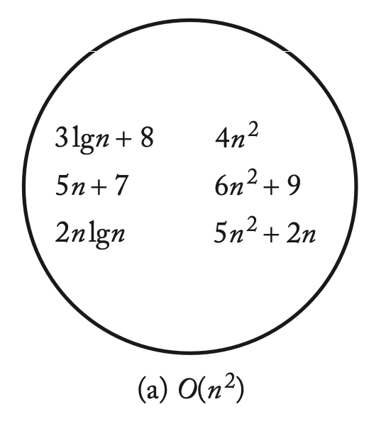

## 시간 복잡도 (Time Complexity)

---

- `basic operation`이 수행되는 횟수
- `input size`(정의역) → `basic operation`(공역)에서 정의되는 함수

## Big O 표기법

---

- 점근적 상한 표기법 (Asymptotic Upper Bound)
- 성능의 하한선 제공 (Worst Case)
  - e.g. 최소한 성능이 `Quadratic`보다는 좋다.

> Def.
> 주어진 복잡도 함수 `f(n)`에 대해서, `O(f(n))`은 다음을 만족하는 복잡도 함수 `g(n)`의 집합이다.
>
> <aside>
> 💡 N <= n인 모든 n에서 g(n) <= c * f(n)을 만족하는 양의 실수 c와 음수가 아닌 정수 N이 존재 (there exist some)
>
> </aside>

